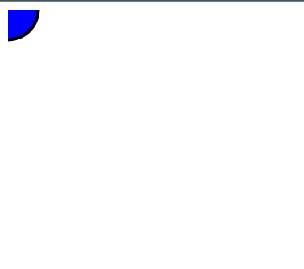
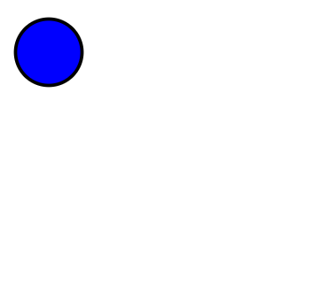

# svg

svg는 벡터 그래픽을 표현하기 위해 사용하며 주로 웹에서 그래픽을 표현하는데에 사용된다.

html svg태그는 svg 그래픽을 담기 위한 컨테이너이다.

**svg의 장점**

jpg,png 등 이미지를 사용하지 않고 svg를 사용하면 얻는 장점은 다음과 같다.

- svg는 확대하거나 리사이징해도 퀄리티가 저하되지 않는다.
- svg는 기존 이미지와 달리 텍스트 에디터를 통해 원하는 대로 수정할 수 있다.
- svg는 기존 이미지에 비해 파일 사이즈가 작다.
- svg는 css나 js로도 수정이 가능하다.
- 애니메이션 효과를 주는 것이 가능하다.
  **사용법**

svg도 이미지이므로 일반 이미지를 사용할 때처럼 img태그의 src속성에 해당 파일을 할당해주면 된다.

```html

```

또한 svg의 장점으로써 html태그로 끌고와 사용자의 취향대로 이미지를 수정할 수 있다.  
이렇게 함으로써 얻을 수 있는 장점은 이미지 태그와 달리 서버로부터 해당 이미지를 요청하지않고 내부에서 인라인적으로 이미지를 사용할 수 있다는 장점이 있다.

이미지의 모양이 복잡하지않다며 용량이 작지만 복잡해질수록 용량이 커진다.  
따라서 간단한 이미지를 표현하는데 svg를 사용하는 것이 유용하다.

svg는 실사진보다는 아이콘, 로고 , 일러스트레이션, 차트, 애니메이션에 적합하다.

## circle

```html
<svg width="100" height="100">
  <circle r="30" stroke="black" stroke-width="3" fill="blue" />
</svg>
```

- r  
  원의 반지름

- cx,cy  
  원의 중심으로부터 떨어진 x,y좌표의 정도이다.  
  default값은 (0,0)으로 되어있으며 다음과 같이 위치하여 있다.



```html
<svg width="100" height="100">
  <circle r="30" cx="40" cy="40" stroke="black" stroke-width="3" fill="blue" />
</svg>
```

위와 같이 지정해주면 다음과 같은 원의 형태를 볼 수 있다.


- fill  
  내부 색상을 정해 줄 수 있는 속성이다.

- stroke  
  선의 색상을 지정해 줄 수 있는 속성이다.

- stroke-width  
  선의 굵기를 지정해 줄 수 있는 속성이다.

## Reference

- https://velog.io/@sbyeol3/SVG%EB%A5%BC-%EA%B3%B5%EB%B6%80%ED%95%B4%EB%B3%B4%EC%9E%90-1-SVG%EB%9E%80
- https://www.freecodecamp.org/news/use-svg-images-in-css-html/
